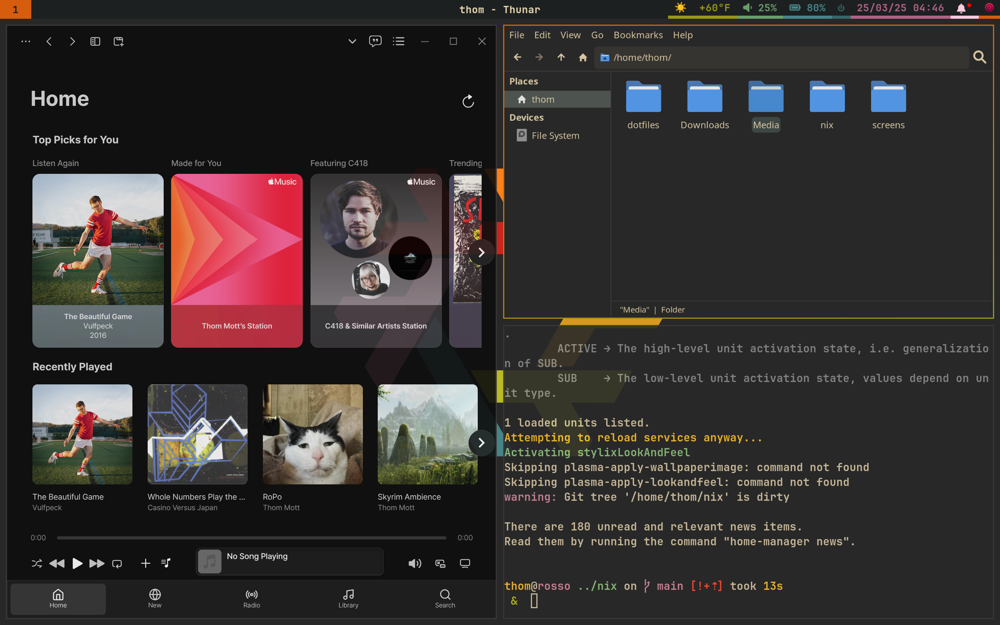

# My NixOS Config

This is my NixOS config. The backbone (nix/home-manager) is based heavily on
Ampersand's "Reborn" config. I've taken that config, and blended it with my old
dots from my Gentoo days. This setup is made for a Lonovo Legion 5 Pro 16ARH7H,
but with some tinkering it should work on most systems with a bit of tinkering.
Plenty of credit due to my good fiends, [wyatt](www.wyatt.wtf) and
[molecule31](https://molecule31.co.ua/) for helping me through the learning
process. This repository will be somewhat active as long as I'm using this
system--I go back and forwards between this and a old Thinkpad running Gentoo,
which I have no intention of moving over to Nix.

The RICE is based off of Ampersands, though I intend to change it quite a bit
once the system is mostly stable. Still plenty to be done! Expect actually
pictures here when it no longer looks exactly like ampersands.

## Tinkering

If you're using a similar system to my own, one with an AMD iGPU and a NVIDIA
dGPU, my Hyprland config should work out of the box for you, hooray! However, in
the likely scenario that you are not, you'll have to do some tweaking. I
generally note chunks of code that I think are not platform agnostic, I intend
to slowly go through and update them to be more modular and control more of the
hardware-specific environmental variables at host-level. For the moment though,
consult the Hyprland wiki, and remove incompatible features.

## Philosophy

I've designed this config to be somewhat portable, in that it will exist on a
few systems, with the same users. But not all systems will need a display
manager, and thus won't need the same packages. As I want each user to exist
(mostly) the same across any system with this configuration, the specific user
configurations can be found in `/users/user.nix`. Those users will also want
their own packages, which can be found in `/users/home-manager/user.nix`. At
time of writing, hosts don't have that much control over what packages they
use--I intend to make this better in the future, and each host will be able to
specify what packages they want from the wider list. I mentioned earlier that
some systems won't have displays, as such graphical applications are mostly
useless. Considering users will likely want graphical applications in their
home-manager configurations. Unless I decide to over-complicate things,
non-graphical hosts will not share their users with graphical systems, it's too
complicated otherwise.

I need to figure out what I'd like to do with `/nixos`, originally I intended it
as "global" packages for all systems, though now I'm not so sure.

## Oddities

While this config should work mostly out of the box, there are a few
applications which will require some tinkering.

### Cider

This is a paid app, and you'll need to [download an AppImage](https://cider.sh/)
you've bought from them. The particular version of Cider you buy matters--Stable
is typically behind by a few months. I don't like being on the unstable branch,
so I've opted to use an overlay for this particular app. Each major release
requires a new purchase, so I am personally not interested in keeping latest.
So, unless you want to use the same version as me (why?) You'll have to update
the overlay yourself. The good news is that I did 0 tweaks from the
[fresh package](https://github.com/NixOS/nixpkgs/blob/master/pkgs/by-name/ci/cider-2/package.nix)
on nixpkgs. So, you'll probably be safe to simply copy and paste whatever the
most recent version is.

### Unity

This program is a fucking headache. My config has a lot of weirdness for Unity
specifically due to Unity's shit Linux support. I use an older version of Unity
because I use it to mod for Unturned. That version only supports OpenSSL 1.1, so
that's the version I've manually overwritten the package to use. When I
inevitably update to a version that supports a modern OpenSSL standard, I'll
bump the package. Regardless, there are some bugs you are likely to run into if
you try to use Unity. I had a strange issue with Firefox being unable to open
"unityhub" links in UnityHub, making it impossible for me to sign in. I'll be
honest I prayed and then it started working. The second issue was Unity's
`bee_background`. Check latest news, they may have fixed it in the future, but
their setup would cause Unity to hang indefinitely. The steps described in
[this guide](https://discussions.unity.com/t/linux-editor-stuck-on-loading-because-of-bee-backend-w-workaround/854480)
fixed the problem for me, but you must do this manually, for every editor
version you install.

Additionally, Unity's many dropdowns and popups are not Hyprland friendly. As
Unity currently does not support a single-window mode like Godot does, there are
a lot of manual window rules set within Hyprland to make Unity a more usable
experience. I haven't manually set these up myself,
[someone else did](https://github.com/nnra6864/HyprlandUnityFix). I've imported
it as a submodule--make sure you're updating it periodically.

### Waybar

My Waybar setup includes a weather widget--this is a leftover from Ampersand's
config. Ampersand chose to hardcode the specific city being checked--I opted to
make it dynamic. It sometimes bugs out a bit, so I may change that in the future
and make it an environmental variable set per machine. For the moment though,
keep that in mind if you disable location services.
