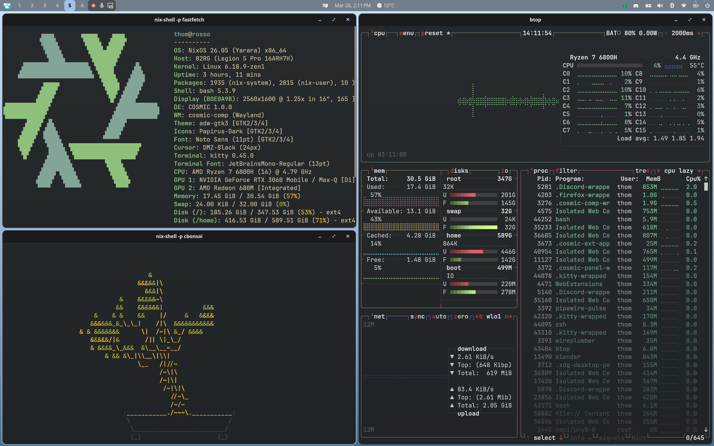

# My NixOS Config

This is my NixOS config, originally based on Ampersand's "Reborn" config,
now based heavily on Quasigod's config.
Plenty of credit due to my good fiends, [wyatt](https://www.wyatt.wtf) and [molecule31](https://molecule31.co.ua/)
for helping me through the learning process.

The Hyprland RICE is based off of Ampersands' RICE.

This config is used across 3 systems with differing hardware, but the same
set of users. Making the config (ideally) multi-user focused was a big priority.
It is also shared by two people, so making it easy to understand and extend
without requiring reading through every config file was a priority.
The `den` framework was appealing for this reason, as the composition of
user defined models it makes seamless makes it very appealing for my needs.

## Mini Docs

As this is a large config, you (and I) won't know everything in it, so I've listed
a few of the oddities or features provided by it below. This is not a complete list.

### FHS

Sometimes, you need to break out of nix for a stubborn binary that relies
on FHS. Thankfully, _NixOS & Flakes Book_ provides a handy
[environment](https://nixos-and-flakes.thiscute.world/best-practices/run-downloaded-binaries-on-nixos)
to simulate FHS. Run `fhs` in the terminal, and you can run most Linux binaries.

### Cider

This is a paid app, and you'll need to [download an AppImage](https://cider.sh/)
you've bought from them for it to install.

### Unity

This program is a fucking headache. My config has a lot of weirdness for Unity
specifically due to Unity's shit Linux support.
Unity's many dropdowns and popups are not Hyprland (or COSMIC) friendly. As
Unity currently does not support a single-window mode. There are
a lot of manual window rules set within Hyprland to make Unity a more usable
experience. I haven't manually set these up myself,
[someone else did](https://github.com/nnra6864/HyprlandUnityFix). I worked with
the maintainer to make a flake for it, and instructions are on that repository.

#### PlasticSCM

PlasticSCM previously did not have a NixOS package. This has recently changed!
Unfortunately, it is often broken due to hash mismatches. I try to keep it up to
date via overlays, but occasionally I may fall behind. Previously, I relied on
DistroBox for this purpose. This is still included, if you want to use it. My
DistroBox setup is not managed by nix, so you must set it up yourself if you
wish to use it.

### Keychain

I use Keychain to manage my SSH & GPG keys. It is automatically launched by zsh
via `.zshrc`. The command written in zsh's config expects that a SSH Config File
can be found in `~/.ssh/`, so you should define one!

## Acknowledgements

[Winter Forest Snow](https://moewalls.com/landscape/winter-forest-snow-live-wallpaper/)
Live wallpaper

[Wavy Grass](https://moewalls.com/landscape/wavy-grass-live-wallpaper/) Live
wallpaper

DeterminateSystems for update-flake-lock GitHub Action
